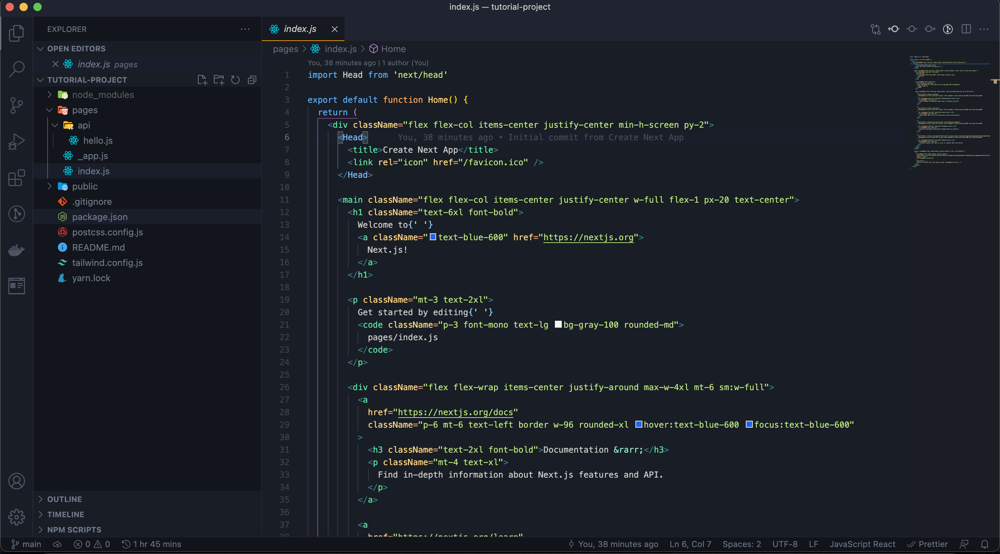

<h1 align="center">Talos Dark Theme</h1>

### Screenshots

---

 
 
 

## Miscallaneous

Talos Dark Theme is also available as an [iTerm2 Theme](https://github.com/DavidAmunga/talos-dark-iterm2-theme) and a [Slack Theme](https://github.com/DavidAmunga/talos-dark-slack-theme)

### More Information

---

- <a href="https://marketplace.visualstudio.com/items?itemName=damunga.talos-dark">Visual Studio Marketplace</a>
- <a href="https://github.com/DavidAmunga/talos-dark-theme.git">Github Repository</a>
